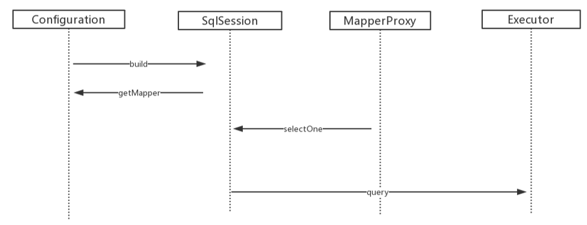
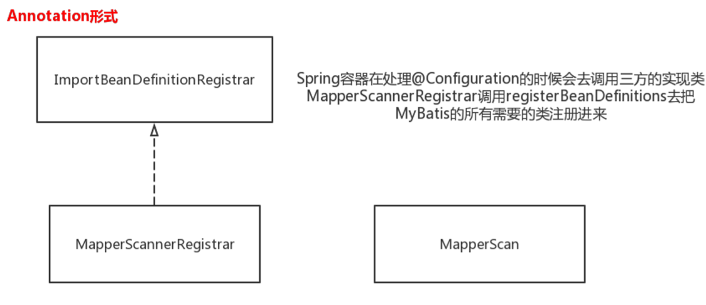
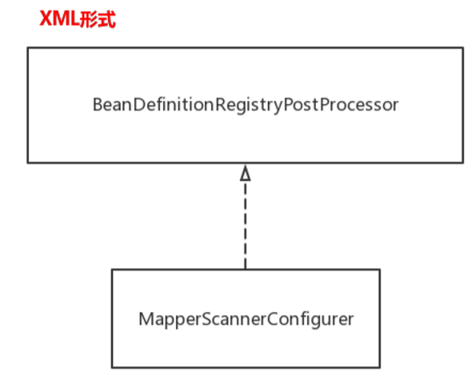

## MyBatis框架源码分析及手写该框架

### MyBatis是什么

一个一流的持久层框架，支持客户化SQL，存储过程和高级映射

### 优势

MyBatis几乎消除了JDBC的所有代码，不需要手动设置参数和获取结果

### 如何做到

使用简单XML或注解做配置，做映射，映射接口，映射POJO到数据库记录

### 对比JDBC和MyBatis

MyBatis封装额对JDBC的操作

### 使用MyBatis

#### 编程式

read XML(Configration)-- SqlSessionFactory --SqlSession -- TestMapper -- 

#### 集成式

集成到Spring中使用

### 工作中使用方式

分析业务

定义表结构

generator生成需要的类

1. pom.xml配置generator插件 <plugin>
2. 配置generatorConfig.xml
3. 执行mvn mybatis-generator:generate
4. 生成Bean和Example

### 作用域 scope

SqlSessionFactoryBuilder method

SqlSessionFactory  application

SqlSession request/method

Mapper   method

### Mapper和annotation

可以同时使用，互补

### configration文件解读

1. enviroment 配置数据源
2. TypeHandler  java和表字段类型转换
3. plugin  数据封装 AOP的一个点，只支持对部分方法拦截

### 配置文件

#### namespace

关联到接口方法，区分类似package的作用

#### resultMap/resultType

resultType一一对应

resultMap不需要写join，有n+1问题

#### sql

相当于一个变量，可以通过include公用

#### CRUD

useGeneratedKeys=“true” keyProperty="id"

#### 动态SQL

#### 缓存

一级缓存： 默认开启,  SqlSession级别  ，同一个方法多次调用，会命中（内存中）

为什么要一级缓存？缓解数据库压力

怎么验证一级缓存？

一级缓存有没有什么问题？

2次同样查询，会命中一级缓存，但是这2次查询中间，相应的数据由更新，导致第二次从缓存拿到的事过期的数据

但是这样写代码的概率低，所以这样设计了

优点大于缺点

二级缓存：默认关闭  基于namespace级别，不建议使用，一帮用redis第三方来代替

namespace下用catch标签打开，然后使用

怎么验证二级缓存？看调用时间costtime，看日志

二级缓存有没什么问题？关联查询的时候，被关联的主体被更新了，但是二级缓存那边还没更新，非常容易出现脏数据

全部失效，更新策略 update delete 整个二级缓存全部清空  也就是更新了id=1的一个数据，他把id=1，2，3...的缓存都清空了

### Best Practice

#### 分页

逻辑分页：MyBatis自带分页机制，基于resultSet， 逻辑分页，内存里面分页 ，不可取的

 物理分页：select ...  limit 1,10

exmaple 可以仿照orderBy clause 添加 limit clause

分页插件：MyBatis-PageHelper

#### 批量操作 Batch

for循环一个个插入，每次都要IO，性能低

foreach拼sql，一次批量插入，性能高，推荐使用,有sql长度限制，List大小最好有长度限制，数据库有个最大传输packet的限制还有net_buffer

show varialbles like '%packet%'

show variable like '%net_buffer%'

Executor.BATCH  要额外获取sqlSession，需要注入一个batchSqlSessionTemplate，没隔一段数据commit一次

#### 联合查询

嵌套结果：

resultMap里面一对一 association  property  coloumn select 是2次io查询

resultMap里面一对多 collection property  ofType

对sql查询出来的结果做一次嵌套，不存在n+1问题

嵌套查询：存在n+1问题

n+1问题：会把1条博客记录和n条该博客的评论都查出来

lazy loading

## 源码分析

###  Configuration  sqlSession   MapperProxy  Executor

首先读取配置文件初始化configuration，configuration构建sqlSession

sqlSession获取mapper接口

mapper调用接口方法，用MapperProxy的是selectOne

调用Executor执行查询

动态代理模式  

策略模式和模板模式结合  Executor  abstract BaseExecutor   

simpleExecutor  ResueExecutor

1. 群族分离

2. 分类选择大类处理

3. 日志共性动作很好的分离

   CatchingExecutor装饰器模式 

   同源同根   ，装饰器和被装饰者都实现同一个接口，注重覆盖 扩张

   同源同根的委派模式就是装饰器模式

   StatementHandler

   prepareStatementhandler

   CallableStatementhandler

   simpleStatementhandler

ResultSethandler

## Mysql1.0

代码和数据库打交道的一个中间件

如何打交道呢？每次打交道通过建立sqlSession通信

框架和外部通信，通过Configurtion（xml、annotation）

parsing解析

sqlSession要执行请求的任务，通过一个Exexutor执行（datasource，transaction，binding）

1.0定义了基本的功能，定义scope

### Mybatis-spring

使用mybatis， 编程式 到集成式  

Spring构造了一个SqlSessionFactoryBean 是FActoryBean的子类

ImportBeanDefinitionRegister   -- MapperScannerRegister  -- registerBeanDefinition

把mybatis需要的类注册进来

