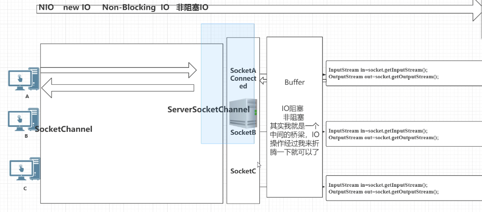
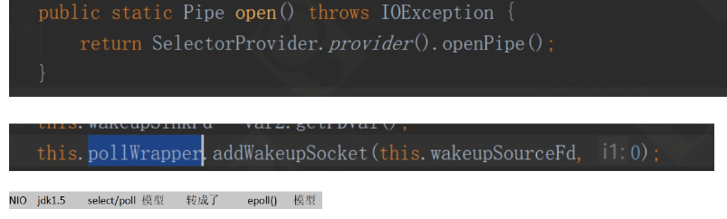
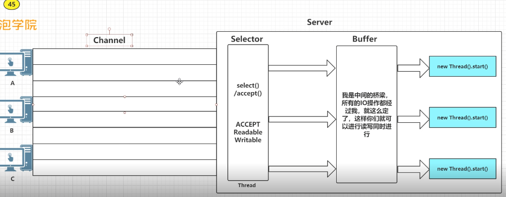
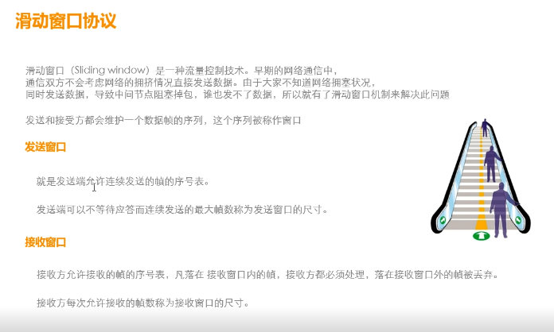
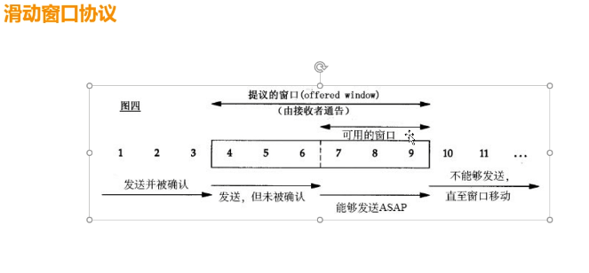

## NIO原理

### IO 是输入输出

1. TCP

发送端                                                                       接收端

send  send  send                         应用层               recv  recv  recv

------------------------------------------------------------------------------------------

TCP发送缓冲区                             传输层                TCP接收缓冲区（size）

TCP报文                                                                     TCP报文

------------------------------------------------------------------------------------------------------------

### BIO窗口滑动协议

发送只有等到缓冲区准备好了，才写入，否则阻塞等待，接受也一样

### NIO

非阻塞IO，Socket和IO线程解耦问题，引入一个事件机制，认为底端有一个IO线程调度，不断扫描每一个socket缓冲区，发现写缓冲区可写，发送一个时间通知一个线程写数据，没有收到写通知的线程可以去做其他事情，不会阻塞

多路复用，不可读的时候，把线程丢到select队列里面，当tcp缓冲区可读，从select里面调一个个线程出来度数据。

# redis多路复用机制

linux的内核会把所有外部设备都看作一个文件来操作，对一个文件的读写操作会调用内核提供的系统命令，返回一个 file descriptor（文件描述符）。对于一个socket的读写也会有响应的描述符，称为socketfd(socket 描述符)。而IO多路复用是指内核一旦发现进程指定的一个或者多个文件描述符IO条件准备好以后就通知该进程

IO多路复用又称为事件驱动，操作系统提供了一个功能，当某个socket可读或者可写的时候，它会给一个通知。当配合非阻塞socket使用时，只有当系统通知我哪个描述符可读了，我才去执行read操作，可以保证每次read都能读到有效数据。操作系统的功能通过select/pool/epoll/kqueue之类的系统调用函数来使用，这些函数可以同时监视多个描述符的读写就绪情况，这样多个描述符的I/O操作都能在一个线程内并发交替完成，这就叫I/O多路复用，这里的复用指的是同一个线程

多路复用的优势在于用户可以在一个线程内同时处理多个socket的 io请求。达到同一个线程同时处理多个IO请求的目的。而在同步阻塞模型中，必须通过多线程的方式才能达到目的

### NIO实现原理

1. 记录socket连接上来---selector
2. 使连接先把road准备好-- Channel
3. Buffer
4. 

selector  open（）

ServerSocketChannel open（）  SelectorProvider.

server.register

Netty