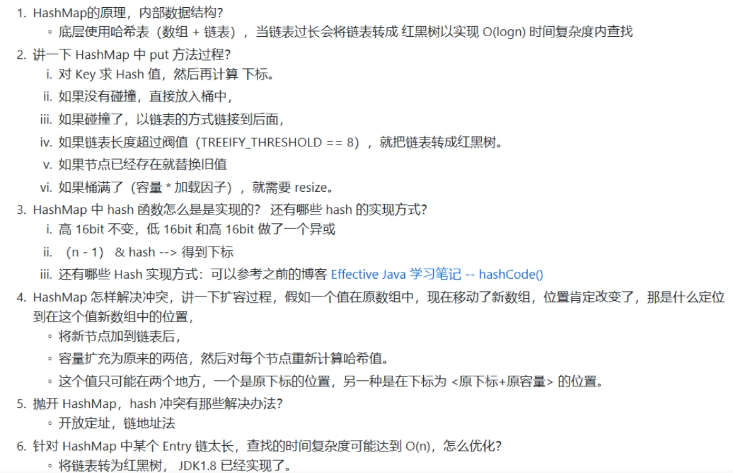

## java8 HashMap 源码分析


#### 看源码猜测

HashMap 类 属性 方法 构造函数

1. 存储数据的节点节点，存储单元

```java
/**
     * Basic hash bin node, used for most entries.  (See below for
     * TreeNode subclass, and in LinkedHashMap for its Entry subclass.)
     */
    static class Node<K,V> implements Map.Entry<K,V> {
        final int hash;
        final K key;
        V value;
        Node<K,V> next;

        Node(int hash, K key, V value, Node<K,V> next) {
            this.hash = hash;
            this.key = key;
            this.value = value;
            this.next = next;
        }
    }
```

2. 维护一个Node类的数组

Node[0]

```java
   /**
     * The table, initialized on first use, and resized as
     * necessary. When allocated, length is always a power of two.
     * (We also tolerate length zero in some operations to allow
     * bootstrapping mechanics that are currently not needed.)
     */
    transient Node<K,V>[] table;
```

3. 数组有一个初始大小,最大大小，负载因子

   ```java
    /**
        * The default initial capacity - MUST be a power of two.
        */
       static final int DEFAULT_INITIAL_CAPACITY = 1 << 4; // aka 16
     /**
        * The maximum capacity, used if a higher value is implicitly specified
        * by either of the constructors with arguments.
        * MUST be a power of two <= 1<<30.
        */
       static final int MAXIMUM_CAPACITY = 1 << 30;
   
     
   ```

   4. 扩容  size / capacity > factor  扩容  翻倍

   ```java
     /**
        * The load factor used when none specified in constructor.
        */
       static final float DEFAULT_LOAD_FACTOR = 0.75f;
      /**
        * The number of key-value mappings contained in this map.
        */
       transient int size;//这个属性不参加序列化
   ```

   

   5. 链表长度: 长度大于8变成红黑树，二叉树的一种，java8开始有，目的加快查找速度

      ```java
      /**
           * The bin count threshold for using a tree rather than list for a
           * bin.  Bins are converted to trees when adding an element to a
           * bin with at least this many nodes. The value must be greater
           * than 2 and should be at least 8 to mesh with assumptions in
           * tree removal about conversion back to plain bins upon
           * shrinkage.
           */
          static final int TREEIFY_THRESHOLD = 8;
      
          /**
           * The bin count threshold for untreeifying a (split) bin during a
           * resize operation. Should be less than TREEIFY_THRESHOLD, and at
           * most 6 to mesh with shrinkage detection under removal.
           */
          static final int UNTREEIFY_THRESHOLD = 6;
      ```

      

   6. put一个key value，计算放到Map的位置

      ```java
      /**
           * Computes key.hashCode() and spreads (XORs) higher bits of hash
           * to lower.  Because the table uses power-of-two masking, sets of
           * hashes that vary only in bits above the current mask will
           * always collide. (Among known examples are sets of Float keys
           * holding consecutive whole numbers in small tables.)  So we
           * apply a transform that spreads the impact of higher bits
           * downward. There is a tradeoff between speed, utility, and
           * quality of bit-spreading. Because many common sets of hashes
           * are already reasonably distributed (so don't benefit from
           * spreading), and because we use trees to handle large sets of
           * collisions in bins, we just XOR some shifted bits in the
           * cheapest possible way to reduce systematic lossage, as well as
           * to incorporate impact of the highest bits that would otherwise
           * never be used in index calculations because of table bounds.
           */
      	hashCode高16位和低16类异或（int 32位）让hash尽可能的分散
          static final int hash(Object key) {
              int h;
              return (key == null) ? 0 : (h = key.hashCode()) ^ (h >>> 16);
          }
      
      
      	if ((p = tab[i = (n - 1) & hash]) == null)
                  tab[i] = newNode(hash, key, value, null);
      ```

      

      计算方法： (n - 1) & hash   n是map的容量，是2的倍数，目的 ，让n-1 和hash的与一直小于等于n-1，而且坚减少碰撞

      数组容量是2次幂，n-1才会是 01111的这种形式的二进制 ，如果不是这种形式的二进制， 那么 (n - 1) & hash 结果产生碰撞的几率会大大增加

      例如容量为16的时候  n=16  ， n的2进制01000，n-1的二进制00111，原因在于  0 & 0或1都是0。

### 源码分析

```java
初始化或2倍扩容
if ((tab = table) == null || (n = tab.length) == 0)
            n = (tab = resize()).length;

计算数组位置，算出位置没有节点，直接放上去
if ((p = tab[i = (n - 1) & hash]) == null)
            tab[i] = newNode(hash, key, value, null);

else {计算出来的地方有节点，判断key是否相等，相等性value替换掉，不相等，放链表
            Node<K,V> e; K k;
            if (p.hash == hash &&
                ((k = p.key) == key || (key != null && key.equals(k))))
                e = p;
 计算处地方有节点，判断是否是红黑树节点
 else if (p instanceof TreeNode)
                e = ((TreeNode<K,V>)p).putTreeVal(this, tab, hash, key, value);
  不是红黑树节点，将链表最后一个节点的next指向新的节点，插入成功，判断量表长度是否超过阈值8，超过将链表树化
 else {
                for (int binCount = 0; ; ++binCount) {
                    if ((e = p.next) == null) {
                        p.next = newNode(hash, key, value, null);
                        if (binCount >= TREEIFY_THRESHOLD - 1) // -1 for 1st
                            treeifyBin(tab, hash);
                        break;
                    }
                    if (e.hash == hash &&
                        ((k = e.key) == key || (key != null && key.equals(k))))
                        break;
                    p = e;
                }
            }
      返回老的值
 if (e != null) { // existing mapping for key
                V oldValue = e.value;
                if (!onlyIfAbsent || oldValue == null)
                    e.value = value;
                afterNodeAccess(e);
                return oldValue;
            }
      
      判断长度，超过阈值 ，2被扩容
      ++modCount;
        if (++size > threshold)
            resize();
        afterNodeInsertion(evict);
      
      扩容2倍
      else if ((newCap = oldCap << 1) < MAXIMUM_CAPACITY &&
                     oldCap >= DEFAULT_INITIAL_CAPACITY)
                newThr = oldThr << 1; // double threshold
      扩容后，数组节点打散到新的table中
      if (oldTab != null) {
            for (int j = 0; j < oldCap; ++j) {
                Node<K,V> e;
                if ((e = oldTab[j]) != null) {
                    oldTab[j] = null;
                    if (e.next == null)
                        newTab[e.hash & (newCap - 1)] = e;
                    else if (e instanceof TreeNode)
                        ((TreeNode<K,V>)e).split(this, newTab, j, oldCap);
                    else { // preserve order
                        Node<K,V> loHead = null, loTail = null;
                        Node<K,V> hiHead = null, hiTail = null;
                        Node<K,V> next;
                        do {
                            next = e.next;
                            判断原来值是否需要在扩容后的数组中移动
                            if ((e.hash & oldCap) == 0) {
                                if (loTail == null)
                                    loHead = e;
                                else
                                    loTail.next = e;
                                loTail = e;
                            }
                            else {
                                if (hiTail == null)
                                    hiHead = e;
                                else
                                    hiTail.next = e;
                                hiTail = e;
                            }
                        } while ((e = next) != null);
                        if (loTail != null) {
                            loTail.next = null;
                            newTab[j] = loHead;
                        }
                        if (hiTail != null) {
                            hiTail.next = null;
                            newTab[j + oldCap] = hiHead;
                        }
                    }
                }
            }
        }
```


### HashMap总结

hash算法，降低碰撞概率，扩容标准，链表变红黑树

HashMap的非线程安全问题解决方案

HashTable ，锁住整张表，然线程独占，安全的背后是巨大的浪费

ConcurrentHashMap，更快更好的并发性，多个读操作几乎总可以并发进行。 锁段，默认把hash表分为16个段， get put remove等操作中，值锁定当前需要的段，只有在求size的时候，锁住整张表。





### 红黑树

红黑树：在二叉查找树上，每个节点增加一个位置存节点颜色，red或black。 特点：任何一条从根到叶子节点的路径上各个节点着色的方式，，确保没有一条路径会比其他路径长出2倍。是一种弱平衡二叉树。相对于平衡二叉树，旋转次数变少，所以搜索，插入，删除较多就用红黑树。

定义：根节点和叶子节点必须是黑的，一个节点是红的，他的2个子节点必须是黑的，对任意节点，没个节点到期叶子节点都包含相同数目的黑节点。

应用：java中的treemap实现使用红黑树，是有序的。


HashMap实现