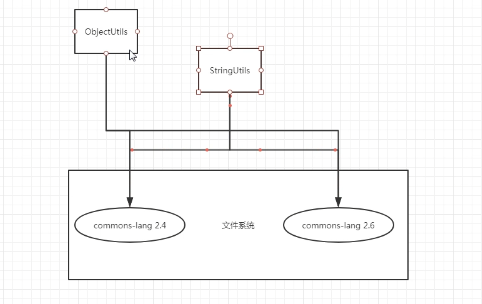

## java9 新特性

Ant Maven 编译时

OSGI运行时  --eclipse工程

Spring之前有使用OSGI模块化，但是后来舍弃了，原因：实际依赖的间接依赖难以把控

多个版本

NoSuchMethodException  文件系统加载的不确定性导致

### java9 模块化

优点：按需取件

缺点：要标记要用的模块类

jar包都有，到实用到那个需要在modle-info.class 里面requires：java.logging

要加载的类变少了，更适合放到嵌入式软件 不如安卓 

启动的时候减少内存，显示的做隔离

javabase

exprots  java.io  显示导出  

