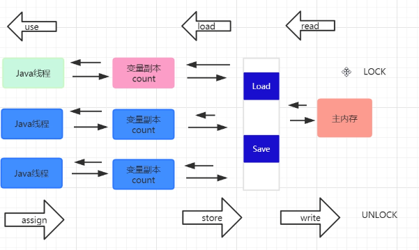
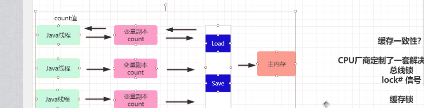
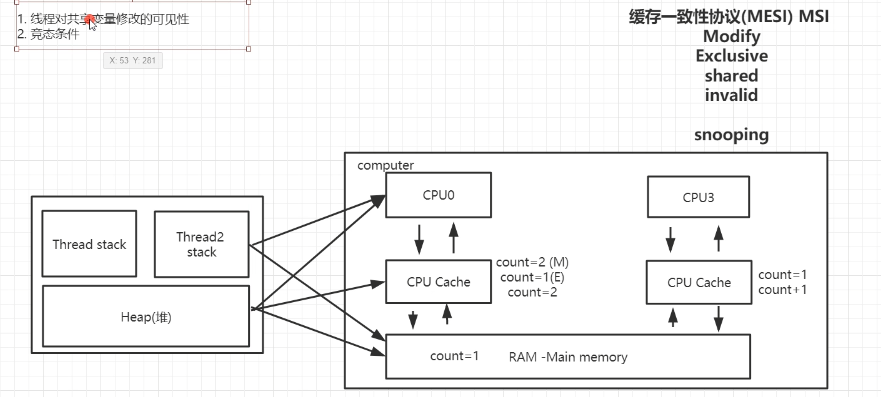

多线程并发总结

线程安全问题：

多个线程同时访问同一个共享变量，导致的问题

静态变量属于共享变量

JMM定义了java内存操作的方式

LOCK  UNLOCK   

read：主内存传输到工作内存

load：工作内存到变量副本

use：使用工作内存的变量

assign：使用之后，重新赋值给工作内存

store：工作内存到变量副本

write：变量副本同步到主存

volatile 修饰的变量 ，保证内存的可见性

指令重排：在保证最终结果不变的情况下，对指令进行重排，提高执行效率

load  -- store 

